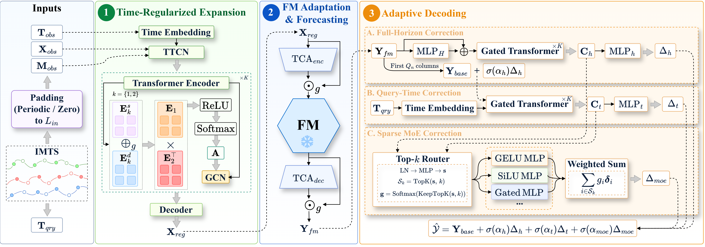

# $\texttt{TREAD}$: Adapting Foundation Models for Irregular Multivariate Time Series Forecasting

## Architecture



## Requirements

- Python 3.11
- PyTorch 2.4.1

Install the required packages:

```bash
conda create -n TREAD python=3.11
conda activate TREAD
conda install pytorch==2.4.1 torchvision==0.19.1 torchaudio==2.4.1 pytorch-cuda=12.4 -c pytorch -c nvidia
pip install -r requirements.txt
```

## Usage

Run all experiments from the project root:

```bash
./scripts/TREAD/run_all.sh
```
